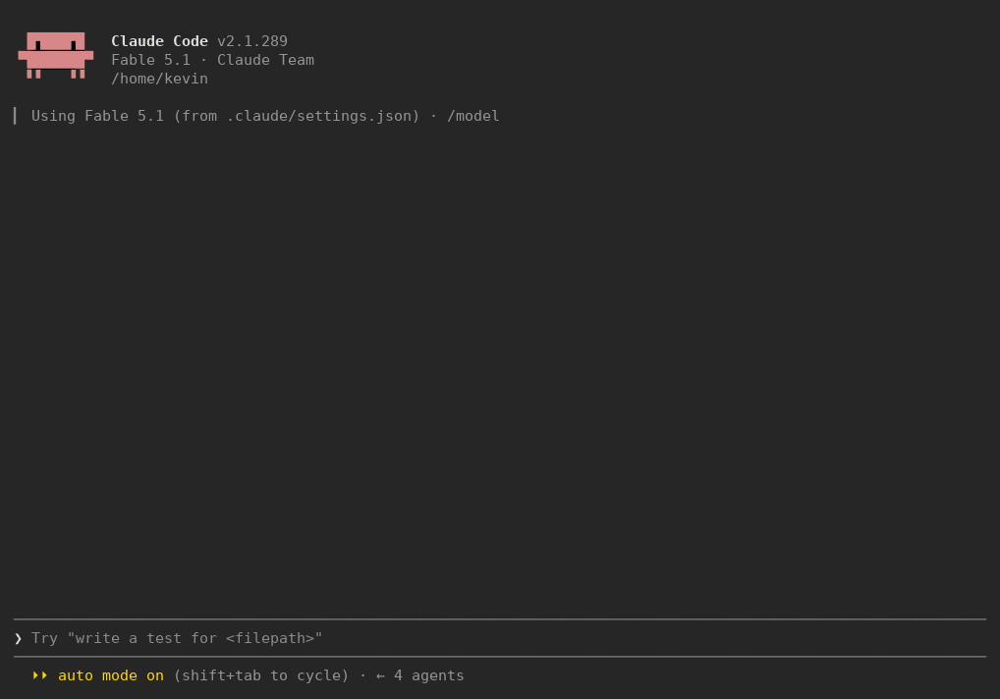

# zen-breath 🧘

[中文](./README.md) | English

A meditation breathing pane for Claude Code. Type `/meditate` and an ASCII Buddha
appears beside your terminal, knocking a wooden fish to pace your breath. When the
session ends it records your lifetime count and daily streak.



*A one-minute demo: box breathing, then `m` to switch to 4-7-8, `p` to pause, `q` to stop.*

<details>
<summary>Text sketch (translated; the pane itself is in Chinese: 吸气 inhale, 屏息 hold, 呼气 exhale)</summary>

```
 🧘 Box breathing 4-4-4-4                         04:32 left

         _ooOoo_
        o8888888o
        88" . "88
        (| ^_^ |)                 ((( 咚
        O\  =  /O                    o
     ____/`---'\____               ,--.
   .'  \\|     |//  `.            (____)
  /  \\|||  :  |||//  \
 /  _||||| -:- |||||_  \
 |   | \\\  -  /// |   |
 | \_|  ''\---/''  |   |
 \  .-\__  `-`  ___/-. /
  `-.________________.-'
         `=---='

 Inhale · 3                                       7 knocks

 [p Pause]  [m Pattern]  [q Stop]

 12 sessions · 58 minutes · 4-day streak
```

</details>

## Features

- Three breathing patterns: box 4-4-4-4, relaxing 4-7-8, calm 5-5
- One knock on the wooden fish at the start of every breath phase, and the Buddha smiles
- In the pane: `p` pauses / resumes, `m` cycles the pattern, `q` stops; closing the pane stops too
- Progress mirrored in the status line, so it still works when the terminal is too narrow for a pane
- A toast on completion; sessions, minutes and streak persist across sessions

## Install

### Option 1: as a marketplace (recommended)

```bash
claude plugin marketplace add mindthink/zen-breath
claude plugin install zen-breath@zen-breath
```

### Option 2: load from a local folder

```bash
git clone https://github.com/mindthink/zen-breath.git ~/.claude/mods/zen-breath
claude --plugin-dir ~/.claude/mods/zen-breath
```

To load it on every start (desktop app included), add to `~/.claude/settings.json`:

```json
{
  "env": {
    "CLAUDE_CODE_PLUGIN_DIRS": "~/.claude/mods/zen-breath"
  }
}
```

## Usage

```
/meditate                 # 5 minutes, same pattern as last time
/meditate 10              # 10 minutes
/meditate 3 relax         # 3 minutes of 4-7-8 relaxing breath
/meditate calm            # 5 minutes of calm breathing
/meditate stats           # show lifetime totals
/meditate stop            # end the current session
```

Patterns: `box` (4-4-4-4), `relax` (4-7-8), `calm` (5-5). Duration: 1 to 120 minutes.

## Development

This is a Claude Code hooks mod (a function-hooks plugin). It has no Node dependency;
all the logic lives in a single file, `hooks/register.tsx`.

```bash
claude plugin validate .      # check the manifest and hooks module
claude plugin test .          # run the tests in tests/
claude --plugin-dir .         # load it in an interactive session; saving a file hot-reloads
```

The declarations under `.claude-plugin/types/` are generated by Claude Code when the mod
loads and are not committed. Once it has loaded once, `tsc -p .` type-checks the mod.

Layout:

```
.claude-plugin/plugin.json      plugin manifest
.claude-plugin/marketplace.json makes this repo installable as a marketplace
hooks/hooks.json                points at the hooks module
hooks/register.tsx              command, ticker, pane rendering
types/index.d.ts                $.state contract (Session / Stats)
tests/zen-breath.test.ts        countdown, pause, pattern cycling, argument checks
```

## License

[MIT](./LICENSE)
